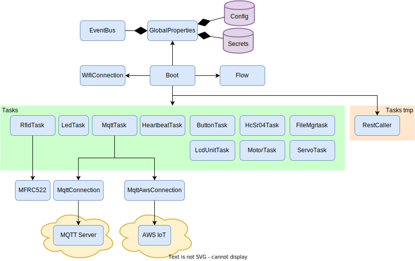
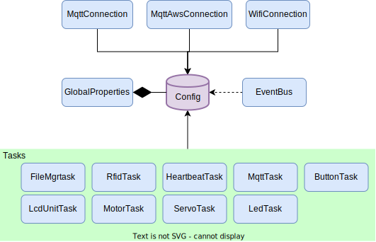

# esp32_util
Utility classes &amp; code for Programming MicroPython on an ESP32

This project contains a framework for programming with an eventbus concept in an ESP32 module using MicroPython.

The mindset is to have a number of Task modules integrating with different hardware & sending and/or receiving events on the event bus and then place all logic into the ***Flows*** component.

The FileTask also enables remote software upload with the option for reboot (for example when adding new logic in the flows file)

Supported Hardware:
* LED
* Buttons
* RFID reader

Supported communication;
* Normal MQTT broker
* AWS IoT MQTT broker

# Overview

## Interaction overview
Here is an overview of how the classes & config files refer to each other:

## Tasks
Here is an overview of the children of the Task class

The Task class is an abstract class defining the interface the other Tasks needs to implement

A Init function & a process function

The Init function will be called after all active components have been created

The process function will be called in each main loop run

## Task information
Information of the content & purpose for the different Tasks can be found in this sub-page:
[Configuration](docs/tasks/tasks-main.md)

## Event bus
Here is an overview of who uses the event bus

The eventbus is created by the GlobalProperties & can be used by anyuone with access to this

## Configuration file usage
Here is an overview of how the classes use the config file:

The config file contains the entire configuration for the application

## Configuration
Information of the content & purpose for the config files can be found in this sub-page:
[Configuration](docs/configuration.md)

# Misc

The following page contains misc info around Micropython & HW pin configurations...

[Misc](docs/misc.md)
